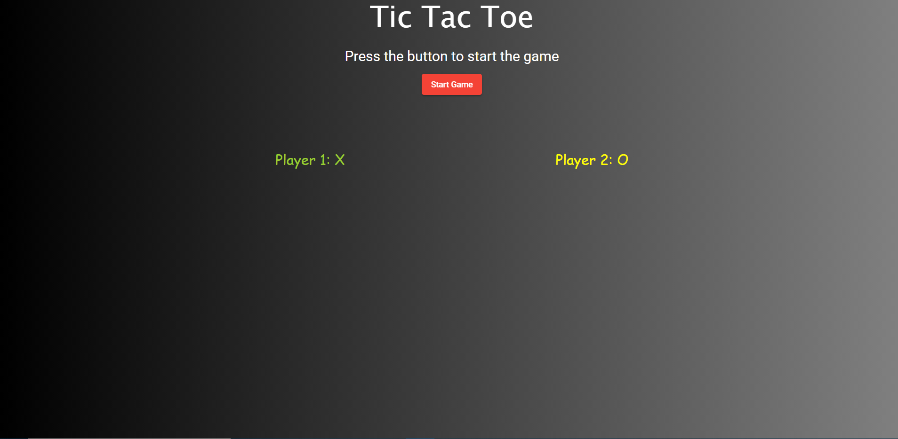
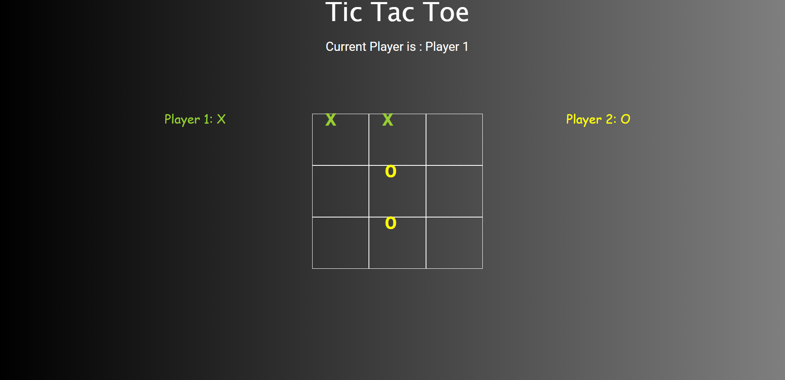

# TicTacToe

This is a simple 2 player TicTacToe(aka cross and nut) game. It is developed using Angular 10 and Bootsrap 4.

## Development server

Run `ng serve` for a dev server. Navigate to `http://localhost:4200/`.

Landing Page

Game Board

